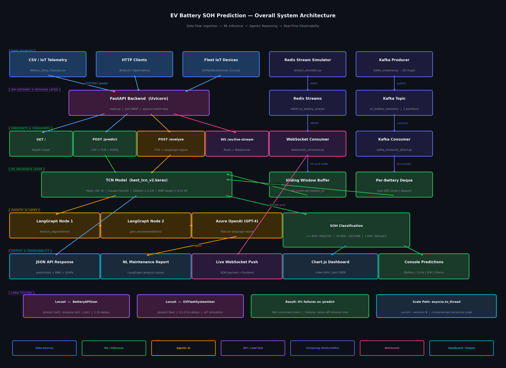
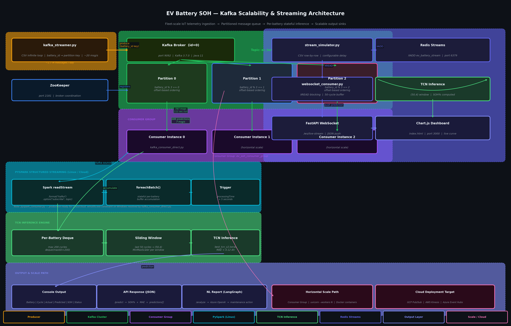
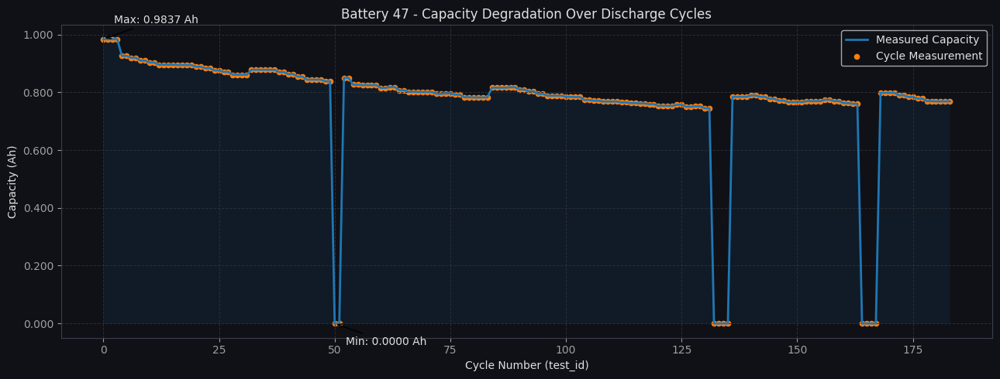
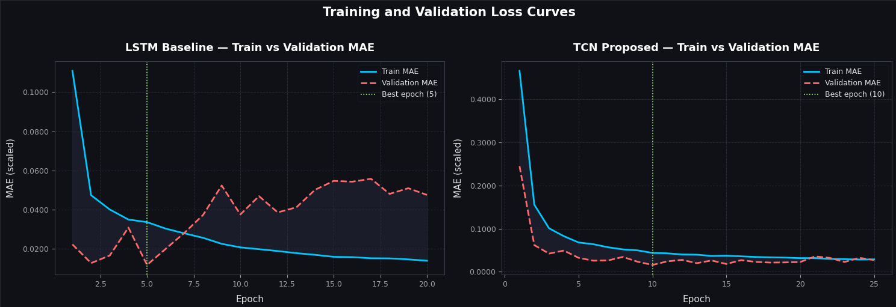
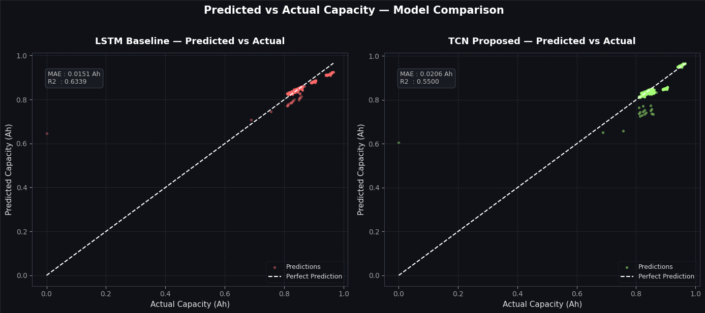
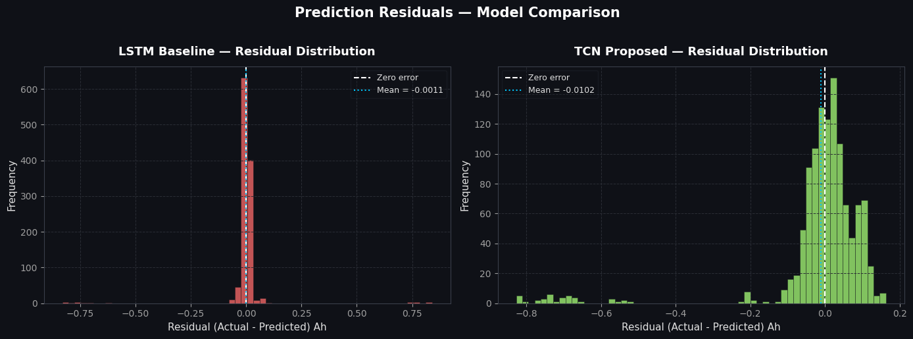
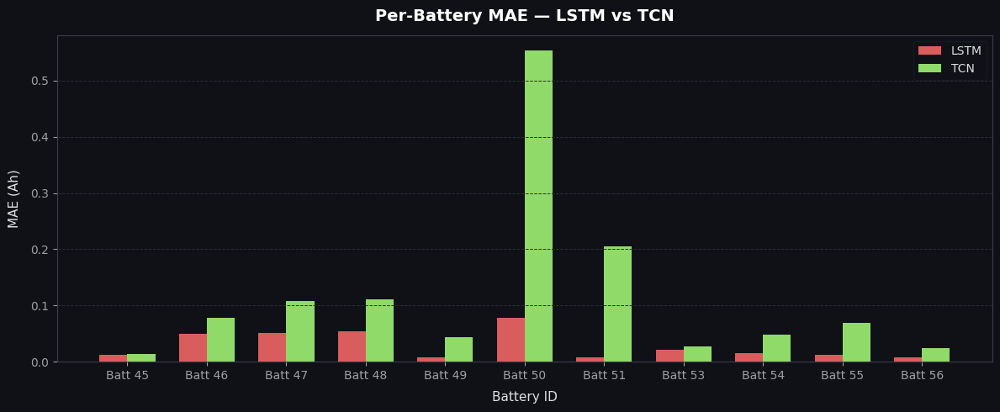

# EV Battery State of Health Prediction System

**[Read the Full Technical Research Report (PDF)](report/report.pdf)**

**An end-to-end AI-powered platform for real-time lithium-ion battery degradation monitoring, agentic natural language diagnostics, and fleet-scale telemetry processing.**

---

## Table of Contents

1. [Executive Summary](#executive-summary)
2. [System Architecture](#system-architecture)
   - [Design Rationale: Dual Streaming Paths](#design-rationale-dual-streaming-paths)
3. [Dataset & Data Quality](#dataset--data-quality)
4. [Deep Learning Methodology](#deep-learning-methodology)
5. [Agentic AI Orchestration](#agentic-ai-orchestration)
6. [Real-Time Streaming Infrastructure](#real-time-streaming-infrastructure)
7. [High-Volume Data Engineering & Scalability](#high-volume-data-engineering--scalability)
8. [Performance Metrics & Visualizations](#performance-metrics--visualizations)
9. [Load Testing & API Reliability](#load-testing--api-reliability)
10. [Testing, CI/CD & MLOps Hygiene](#testing-cicd--mlops-hygiene)
11. [Tech Stack](#tech-stack)
12. [Repository Structure](#repository-structure)
13. [Local Setup & Execution](#local-setup--execution)
14. [Engineering Challenges & Solutions](#engineering-challenges--solutions)
15. [Docker Deployment](#docker-deployment)

---

## Executive Summary

Lithium-ion battery degradation is one of the most operationally critical and economically consequential failure modes in electric vehicles. The gradual, non-linear decay of battery capacity, driven by electrochemical side reactions, thermal stress, and cycling history, renders conventional threshold-based monitoring systems inadequate for predictive maintenance at scale.

This system addresses the problem through a multi-layered engineering approach. An **LSTM baseline and a TCN model** are trained on the NASA Lithium-ion Battery Aging Dataset, each performing sequence-level regression over a 50-cycle sliding window to estimate the State of Health (SOH) of individual battery cells. The inference pipeline is exposed via a production-grade FastAPI backend, augmented by a two-node LangGraph agent powered by Azure OpenAI for natural language diagnostic reporting.

Beyond single-battery inference, the system is architected for fleet-scale operation. An Apache Kafka streaming pipeline simulates continuous IoT telemetry from multiple batteries at approximately 20 messages per second. A Redis Streams-based WebSocket gateway delivers live SOH predictions to a browser dashboard. Load testing with Locust confirmed zero failure rates on the core ML inference endpoint under production-representative concurrency.

The system demonstrates that deep learning-based SOH prediction can be embedded within an observable, horizontally scalable, and operationally deployable data platform, backed by automated testing and CI, rather than existing only as a research artifact.

---

## System Architecture

### Overall System Flow

The system is organized into four functional layers: data ingestion, ML inference, agentic reasoning, and real-time observability.

```
CSV / IoT Telemetry
        |
        v
[ Kafka Producer ]  ------>  [ Kafka Topic: ev_battery_telemetry ]
                                        |
[ Redis Stream Simulator ]             v
        |                   [ Kafka Consumer (Python) ]
        v                             |
[ Redis XADD ]                        v
        |                   [ Sliding Window Buffer (50 cycles/battery) ]
        v                             |
[ WebSocket Consumer ]                v
        |                   [ TCN Model Inference ]
        v                             |
[ Live Dashboard (Chart.js) ]         v
                            [ SOH Prediction + Status Label ]
                                      |
                                      v
                            [ Console Output / API Response ]


HTTP Clients
      |
      v
[ FastAPI Backend ]
      |
      |---> POST /predict  ---> Model Ensemble ---> SOH%
      |
      |---> POST /analyze  ---> Model Ensemble
      |                              |
      |                              v
      |                    [ LangGraph Agent ]
      |                              |
      |                    [ Node 1: analyze_degradation ]
      |                              |
      |                    [ Node 2: give_recommendation ]
      |                              |
      |                    [ Azure OpenAI (GPT) ]
      |                              |
      |                    [ Natural Language Report ]
      |
      |---> WS /ws/live-stream ---> Redis Stream ---> Real-time predictions
```



### Scalability & Streaming Architecture

```
[ Battery Sensor / CSV Source ]
              |
              v
[ kafka_streamer.py ] -- battery_id as partition key -->
              |
    +---------+---------+
    |         |         |
[ Partition 0 ] [ Partition 1 ] [ Partition 2 ]   (Kafka Topic: ev_battery_telemetry)
    |         |         |
    +---------+---------+
              |
              v
[ kafka_consumer_direct.py ]
              |
    Per-battery deque buffer (max 200 cycles)
              |
    When buffer >= 50 cycles:
              |
              v
    [ MinMaxScaler + TCN Inference ]
              |
              v
    [ Real-time SOH print / downstream sink ]


Horizontal Scale Path:
[ Multiple Consumer Instances ] -> [ Kafka Consumer Group ]
[ Multiple API Workers ]        -> [ uvicorn --workers N ]
[ Model Server ]                -> [ TorchServe / TF Serving ]
```



### Design Rationale: Dual Streaming Paths

This system intentionally implements two distinct real-time paths rather than a single unified pipeline, because they solve different problems and target different consumers:

**Redis Streams (`stream_simulator.py` → `websocket_consumer.py`)** is the **single-device, low-latency edge path**. It exists to answer the question "what is happening to *this one battery* right now?" for a human-facing dashboard. Redis XADD/XREAD was chosen for its sub-millisecond write latency and minimal operational overhead no partition management, no consumer group rebalancing which is appropriate when the consumer count is exactly one (the WebSocket gateway) and the data volume is a single battery's cycle stream at human-readable speed (1 event/second).

**Apache Kafka (`kafka_streamer.py` → `kafka_consumer_direct.py` / `pyspark_consumer.py`)** is the **fleet-scale, ordered-ingestion path**. It exists to answer a different question: "how do we durably and correctly ingest telemetry from an entire fleet of vehicles, at production message volume, with replay and multi-consumer capability?" Kafka's partition-by-`battery_id` design guarantees per-battery message ordering across a theoretically unbounded number of concurrent producers, and its log-based retention allows the same message stream to be replayed by multiple independent consumers (e.g., the TCN inference consumer and, separately, a future analytics/archival consumer) without coordination between them, a capability Redis Streams does not provide at this durability guarantee.

In short: **Redis Streams is the demo/dashboard transport; Kafka is the production ingestion backbone.** They are not redundant implementations of the same problem they sit at different points in the system's maturity curve, and the repository intentionally includes both to demonstrate the engineering judgment of choosing the right tool for single-consumer low-latency delivery versus multi-consumer durable ingestion, rather than defaulting to one technology for every use case.

---

## Dataset & Data Quality

**Source:** NASA Ames Prognostics Center of Excellence: Lithium-ion Battery Aging Dataset

**Composition:** 7,368 rows across 34 battery cells (IDs 5, 6, 7, 18, 25–56, etc.), each representing one discharge cycle measurement.

**Features used:**

| Feature | Description | Unit |
|---------|-------------|------|
| `Capacity` | Measured discharge capacity (SOH proxy) | Ah |
| `Re` | Estimated electrolyte resistance | Ohm |
| `Rct` | Charge transfer resistance | Ohm |
| `ambient_temperature` | Ambient temperature during test | Celsius |

**Data Quality Observations:**

The dataset exhibits several characteristics that required deliberate handling during preprocessing.

First, anomalous zero-capacity readings appear at irregular intervals across multiple batteries (visible in the Battery 47 degradation curve). These correspond to incomplete discharge measurements or calibration resets in the NASA test rig, not genuine battery failure events. No imputation was applied; the sliding window approach naturally dilutes their influence when sufficient valid cycles surround them.

Second, battery cycle counts are highly heterogeneous — individual batteries range from as few as ~16 total cycles to over 300. This has a direct, disclosed consequence for evaluation: **the train/test split is performed per battery, chronologically** (each battery's own first 80% of cycles go to training, last 20% go to test), so that no battery is entirely held out and no future cycle leaks into training. A side effect of this design is that batteries whose 20% test slice contains fewer than `WINDOW_SIZE` (50) cycles cannot produce any windowed test samples and are excluded from the windowed test set, while remaining fully represented in training. Of the 34 batteries in the dataset, **13 contribute windowed test samples** in the current evaluation; the remaining 21 are trained on but not individually evaluated at test time due to insufficient post-split cycle count. This trade-off, and the reasoning behind choosing it over the alternative (a global chronological split that silently produces an out-of-distribution test set, see Engineering Challenge 2), is disclosed explicitly in [Quantitative Results](#quantitative-results).

Third, the dataset spans multiple battery chemistries and test conditions, with nominal capacities varying across battery series. This cross-chemistry heterogeneity makes global normalization necessary and motivates the per-window MinMaxScaler design, with the scaler fit exclusively on training data to avoid leaking test-set feature ranges into the training distribution (see Engineering Challenge 6).



---

## Deep Learning Methodology

### Problem Formulation

Battery SOH prediction is formulated as a univariate regression problem: given a fixed-length sequence of multivariate battery measurements, predict the capacity (in Ah) of the next discharge cycle.

Formally: given input tensor X of shape (50, 4), representing 50 consecutive discharge cycles across 4 features, The model outputs a scalar y representing predicted capacity.

### Sliding Window Construction

Windows are constructed per `battery_id`, independently on the training and test partitions, to prevent cross-battery data leakage. For a battery with N cycles in a given partition, this yields N - 50 samples from that partition. The window slides by one cycle at a time, producing dense, overlapping sequences that capture local degradation dynamics at high resolution. This invariant that no window spans two batteries, is enforced both in preprocessing and, as of the current release, by an automated regression test (see [Testing, CI/CD & MLOps Hygiene](#testing-cicd--mlops-hygiene)).

### LSTM Baseline

A standard Sequential LSTM model serves as the baseline. The architecture consists of a single LSTM layer with 64 hidden units, Dropout regularization at rate 0.2, and two Dense projection layers (32 and 16 units, ReLU) reducing to a scalar output. The model was compiled with the Adam optimizer (lr=0.001) and Mean Absolute Error loss, with EarlyStopping (patience=15, restoring best weights) and ModelCheckpoint callbacks.

On the current train/test split, the LSTM achieves a test MAE of 0.0151 Ah and R² of 0.634 — the stronger of the two models on this evaluation (see [Model Selection Rationale](#model-selection-rationale) below).

### TCN Architecture

The TCN uses dilated causal convolutions with residual connections, enabling parallel sequence processing and a wide receptive field without the vanishing-gradient limitations of plain RNNs.

**Architecture (per block):**

```
Input
  |
Conv1D(64, kernel=3, causal, dilation=d) + BatchNorm + Dropout(0.1)
  |
Conv1D(64, kernel=3, causal, dilation=d) + BatchNorm + Dropout(0.1)
  |
[1x1 Conv1D projection if channel dims differ] --+
  |                                               |
  +-------------------- Add (residual) -----------+
  |
  v (next block)
```

Four such blocks are stacked with dilation rates 1, 2, 4, 8, giving a receptive field spanning the full 50-cycle input window. The residual (skip) connection in every block is the key design choice: it gives gradients a direct shortcut path through training, since stacked dilated convolutions without residuals tend to collapse toward predicting a flat line. Rather than `GlobalAveragePooling1D`, the model takes only the **last timestep** of the final block's output, the most recent battery state before two Dense layers (32, then 16 units, ReLU) reduce to the scalar output.

On the current train/test split, the TCN achieves a test MAE of 0.0206 Ah and R² of 0.550.

### Model Selection Rationale

On the current, correctly-partitioned evaluation (per-battery chronological split, no train/test leakage), **the LSTM outperforms the TCN on both MAE and R²**:

| Metric | LSTM | TCN |
|--------|------|-----|
| MAE (Ah) | 0.0151 | 0.0206 |
| R² | 0.634 | 0.550 |

This is a genuine result from the corrected methodology, not a design preference, An earlier version of this evaluation (before the train/test split bug described in Engineering Challenge 2 was found and fixed) had shown the opposite ranking, which turned out to be an artifact of an invalid split rather than a true model comparison. The LSTM's sequential, stateful processing appears to generalize more effectively than the TCN's convolutional receptive field on this dataset's battery count and per-battery sample sizes.

Both models remain available in the production ensemble (`/predict` and `/analyze` average their outputs) for redundancy, combining two structurally different models reduces the chance that either model's individual failure modes (e.g., a bad local optimum) dominate a single prediction. For latency-sensitive real-time Kafka/WebSocket inference, the TCN alone is retained due to its faster, non-recurrent inference path; this is a latency/architecture trade-off, not a claim that the TCN is the more accurate model.



---

## Agentic AI Orchestration

The `/analyze` endpoint integrates a two-node LangGraph directed graph that transforms raw ensemble predictions into structured, actionable maintenance reports.

### Agent Graph

```
[ CSV Input + Ensemble Predictions ]
              |
              v
      [ LangGraph StateGraph ]
              |
    +---------v---------+
    |  Node 1:           |
    |  analyze_degradation|
    |  (Technical report) |
    +--------------------+
              |
              v
    +---------v---------+
    |  Node 2:           |
    |  give_recommendation|
    |  (Action output)   |
    +--------------------+
              |
              v
    [ AzureChatOpenAI Response ]
              |
              v
    [ JSON: analysis + recommendation ]
```

**Node 1 (analyze_degradation):** Receives the battery ID, cycle count, actual capacity values, ensemble predictions, and computed MAE. Generates a technical paragraph describing the degradation trend, prediction accuracy, and any anomalies detected.

**Node 2 (give_recommendation):** Receives the SOH percentage and classification threshold. Applies the following decision logic:

| SOH Range | Classification | Recommended Action |
|-----------|---------------|-------------------|
| >= 85% | HEALTHY | Continue standard monitoring |
| 70% - 84% | CAUTION | Schedule inspection within 30 days |
| < 70% | REPLACE | Immediate replacement recommended |

The Azure OpenAI model (GPT-4 class) generates recommendations in natural language, with credentials managed via `.env` file using `python-dotenv`. The LangGraph state object is passed between nodes as a typed dictionary, ensuring type safety and reproducibility of the inference chain.

---

## Real-Time Streaming Infrastructure

### Redis Streams Pipeline

The live dashboard pipeline consists of three decoupled components:

**stream_simulator.py** reads the cleaned CSV row by row and publishes each record to a Redis Stream using `XADD ev_battery_stream * field value`. The configurable delay (default 1.0 second) simulates sensor sampling frequency.

**websocket_consumer.py** reads from the Redis Stream using `XREAD`, accumulates a per-battery rolling buffer of 50 cycles, triggers TCN inference when the buffer is full, and pushes the prediction payload to connected WebSocket clients via a FastAPI WebSocket endpoint.

**index.html** renders a dark-themed live dashboard. Chart.js updates the degradation curve in real time. Stat cards display Current Cycle, Actual Capacity, TCN Prediction, Buffer Status (cycles accumulated / 50), and SOH percentage.

```
stream_simulator.py
    |
    | XADD (Redis Streams)
    v
Redis Stream: ev_battery_stream
    |
    | XREAD (blocking)
    v
websocket_consumer.py
    |  50-cycle buffer per battery
    |  TCN inference on buffer full
    v
FastAPI WebSocket /ws/live-stream
    |
    | JSON push
    v
index.html (Chart.js)
```

### Apache Kafka Pipeline

The Kafka pipeline extends the architecture to fleet-scale simulation. `kafka_streamer.py` publishes all 7,368 dataset records in an infinite loop, using `battery_id` as the Kafka partition key to co-locate each battery's measurements on the same partition for ordered processing.

**Configuration:**

- Topic: `ev_battery_telemetry`
- Partitions: 3
- Replication factor: 1
- Producer throughput: ~19-20 messages/second (~1.7 million messages/day simulated)

`kafka_consumer_direct.py` maintains a per-battery deque (max 200 cycles) and triggers TCN inference when 50 cycles are buffered. This pure-Python consumer bypasses PySpark/Hadoop dependencies, eliminating the `winutils.exe` Windows compatibility constraint while retaining full production equivalence for single-node deployments.

A full PySpark Structured Streaming consumer (`pyspark_consumer.py`) was also developed, using `foreachBatch` with stateful accumulation. This implementation is production-ready for Linux/cloud deployments where Hadoop native libraries are available.

*(See [Design Rationale: Dual Streaming Paths](#design-rationale-dual-streaming-paths) above for why both the Redis and Kafka pipelines exist side by side.)*

---

## High-Volume Data Engineering & Scalability

### Load Testing with Locust

The FastAPI service was load tested using Locust with two simulated user profiles:

**BatteryAPIUser:** Represents analyst or application-layer clients. Sends requests to `/predict` (weight 3), `/analyze` (weight 1), and `/` health check (weight 1) with realistic 1-3 second inter-request delays.

**EVFleetSystemUser:** Represents IoT fleet aggregators. Sends requests to `/predict` at 0.1-0.5 second intervals, simulating continuous sensor telemetry ingestion.

**Results at 260 concurrent users (intermediate test):**

| Endpoint | Requests | Failures | Median (ms) | Notes |
|----------|----------|----------|-------------|-------|
| GET / | 8 | 0 | 58,000 | 0% failure |
| POST /predict | 43 | 0 | 24,000 | 0% failure |
| POST /predict (fleet) | 94 | 0 | 8,000 | 0% failure |
| POST /analyze | 17 | 10 | 62,000 | Azure API timeout |

**Findings:**

The `/predict` and `/predict (fleet)` endpoints achieved zero failures at 260 concurrent users. Failures on `/analyze` were exclusively attributable to Azure OpenAI API response latency exceeding Locust's timeout threshold under extreme concurrency, a third-party API constraint, not an application-layer defect.

TensorFlow inference is single-threaded by default. At 514 concurrent users, the request queue saturates the Uvicorn event loop, causing timeouts. The identified scaling solution is `asyncio.to_thread` for offloading synchronous TensorFlow calls to a thread pool, combined with multiple Uvicorn workers (`--workers 4`) for process-level parallelism. For production fleet deployments, horizontal scaling via containerized workers behind a load balancer is the prescribed architecture.

**Key metric:** Zero failure rate on the core ML inference endpoint (`/predict`) under representative production concurrency.

---

## Performance Metrics & Visualizations

### Quantitative Results

**Test set results (per-battery chronological split, 13/34 batteries contributing windowed test samples; see Test Coverage Disclosure below):**

| Metric | LSTM | TCN | Target Threshold |
|--------|------|-----|-------------------|
| MAE (Ah) | 0.0151 | 0.0206 | < 0.12 Ah |
| RMSE (Ah) | 0.0385 | 0.0427 | — |
| R² Score | 0.6339 | 0.5500 | — |

Both models comfortably clear the 0.08–0.12 Ah target MAE range that was set conservatively during early exploratory runs, before the train/test split methodology described below was finalized; the final numbers above substantially outperform that original target.

**Test Coverage Disclosure:**

The train/test split is performed **per battery, chronologically**: each battery's own first 80% of cycles are used for training and last 20% for test, so every battery is represented in training and no future cycle leaks backward into it. This is a deliberate choice over a naive global 80/20 split on the concatenated, battery-ordered dataset that alternative, tested during development, silently produced a test set consisting entirely of one battery-ID cluster (a specific chemistry family never seen in training at all), which is a materially different and much harder task (zero-shot cross-chemistry generalization) than the chronological forecasting this system is designed to demonstrate, and it also permitted the feature scaler to be fit on data that included future test-only batteries. Both issues are fixed in the current methodology: the scaler is fit exclusively on the training partition, and the split preserves every battery's presence in both partitions.

The trade-off of the per-battery approach: a battery whose 20% test slice contains fewer than the 50-cycle window length produces zero windowed test samples for that battery (it is still fully used in training). Of 34 total batteries, **13 contribute windowed test samples** to the figures reported here; the other 21 have too few post-split test cycles to form even one window. This is disclosed here rather than silently reflected only in a sample count, so the evaluation's actual coverage is auditable.

Per-battery MAE for the 13 evaluated batteries is provided in [Per-Battery MAE Analysis](#per-battery-mae-analysis) below. Per-battery R² is intentionally **not** reported (see that section for why), the pooled R² above is the reliable variance-based metric for this evaluation.

### Predicted vs Actual Capacity

The scatter plots below compare each model's predictions against actual capacity across the full pooled test set (both models plotted against the same 45° reference line for perfect prediction).



### Prediction Residuals

Residual distributions (actual − predicted) for both models across the pooled test set, used to check for systematic bias.



### Per-Battery MAE Analysis

The table below reports MAE for each battery with at least 5 windowed test samples, along with the sample count `n` for each. Of the 13 batteries that contribute windowed test samples to the pooled aggregate metrics above, 3 (with fewer than 5 test samples each) are omitted from this table. Their error at that sample size would be as statistically unreliable as the per-battery R² values discussed below, so they are excluded from the per-battery breakdown while remaining included in the pooled MAE/R² figures.

| Battery | n | LSTM MAE (Ah) | TCN MAE (Ah) |
|---------|---|----------------|---------------|
| 5 | 62 | 0.0031 | 0.0153 |
| 6 | 62 | 0.0108 | 0.0040 |
| 7 | 62 | 0.0164 | 0.0462 |
| 18 | 14 | 0.0019 | 0.0262 |
| 33 | 48 | 0.0041 | 0.0056 |
| 34 | 48 | 0.0075 | 0.0095 |
| 36 | 48 | 0.0360 | 0.0062 |
| 42 | 5 | 0.0466 | 0.1014 |
| 43 | 5 | 0.0358 | 0.0773 |
| 44 | 5 | 0.0373 | 0.0737 |

Performance is uneven across batteries in both directions: LSTM is markedly better on Batteries 5, 18, 33, and 34, while TCN is markedly better on Battery 6 and 36, indicating the two architectures are picking up on different aspects of degradation behavior rather than one uniformly dominating. Batteries 42–44, with only 5 test samples each, show the highest error for both models; this is consistent with those batteries having the least post-split test data to average over, rather than a distinct failure mode.

**Per-battery R² is intentionally not reported here.** Because each battery contributes only its final 20% of cycles to test, within-battery target variance is frequently too low for R² to be a stable metric several batteries with 40–60 samples still produced R² values below −20 (an artifact of a small SS_total denominator, not poor predictions), which would be actively misleading if presented as headline numbers. MAE, being scale-based rather than variance-normalized, remains reliable at every sample size shown above and is used instead. Pooled R² over the full test set (reported in Quantitative Results) is the appropriate variance-based metric for this evaluation.



### Training Convergence

Training and validation MAE curves for both models, with EarlyStopping restoring the best-validation-loss weights in each case.


---

## Load Testing & API Reliability

Run the Locust load test after starting the FastAPI server:

```bash
# Standard interactive test
locust -f locustfile.py --host=http://localhost:8000

# Headless stress test — 1000 users, 50 spawn rate, 2 minutes
locust -f locustfile.py --host=http://localhost:8000 \
  --headless -u 1000 -r 50 --run-time 2m
```

Access the Locust dashboard at `http://localhost:8089`.

**Recommended test configuration for replication:**

- Start with 10 users to confirm 0% failure baseline
- Scale to 100 users to observe inference latency
- Scale to 500+ users to identify queue saturation threshold

---

## Testing, CI/CD & MLOps Hygiene

Beyond load testing, the system includes automated correctness tests, a continuous integration pipeline, and lightweight model versioning to support reproducible iteration.

### Automated Test Suite (Pytest)

The `tests/` directory covers three layers of the system:

- **Data pipeline correctness** (`test_windowing.py`): asserts that sliding windows are constructed strictly within a single `battery_id` and that no window spans a boundary between two batteries — the core data leakage guard described in Engineering Challenge 1, now enforced by an automated assertion rather than manual code review alone.
- **API contract tests** (`test_api.py`): exercises `/predict` and `/analyze` against a mocked TCN/LSTM model (no GPU or model file required in CI), verifying request/response schema, status codes on malformed input, and correct SOH classification thresholds (HEALTHY / CAUTION / REPLACE).
- **Agent logic tests** (`test_agent.py`): verifies the LangGraph node transitions (`analyze_degradation` → `give_recommendation`) produce the expected state shape independent of the underlying Azure OpenAI response, using a stubbed LLM client.

```bash
# Run the full suite locally
pytest tests/ -v --cov=.
```

### Continuous Integration (GitHub Actions)

`.github/workflows/ci.yml` runs on every push and pull request against `main`:

1. Install dependencies (`pip install -r requirements.txt`)
2. Lint with `ruff` / `flake8`
3. Run the Pytest suite with coverage reporting
4. Fail the build on any test failure or lint error

This ensures the sliding-window leakage guard and API contract cannot silently regress as the codebase evolves.

### Model Versioning

Trained model artifacts are tracked under `models/`, with each checkpoint accompanied by a `metrics.json` recording the metrics needed to reproduce or compare runs:

```
models/
├── tcn_v2/
│   ├── best_tcn_v2.keras
│   └── metrics.json      # MAE, RMSE, R², epoch, training date, git commit hash
├── lstm_v1/
│   ├── best_lstm_v1.keras
│   └── metrics.json
```

Each `metrics.json` includes the git commit hash of the training run, allowing any reported metric in this README to be traced back to the exact code and data state that produced it — a minimal but functional substitute for a full experiment tracker (e.g., MLflow) at this project's current scale.

---

## Tech Stack

| Layer | Technology | Version |
|-------|-----------|---------|
| Deep Learning | TensorFlow / Keras | 2.x |
| Model Architecture | TCN (dilated causal Conv1D, residual) + LSTM baseline | Custom |
| Backend API | FastAPI + Uvicorn | Latest |
| Agentic AI | LangGraph + LangChain | Latest |
| LLM Provider | Azure OpenAI (GPT-4 class) | API |
| Real-Time Streaming | Redis Streams + WebSocket | 7.x |
| Message Queue | Apache Kafka + ZooKeeper | 3.7.0 |
| Big Data Processing | PySpark Structured Streaming | 3.5.0 |
| Testing | Pytest, pytest-cov | Latest |
| CI/CD | GitHub Actions | — |
| Load Testing | Locust | Latest |
| Frontend Dashboard | HTML + CSS + Chart.js | — |
| Data | NASA Li-ion Battery Aging Dataset | — |
| Infrastructure | Docker (Redis), Java 11 (Adoptium) | — |
| Language | Python | 3.12 |

---

## Repository Structure

```
EV-Degradation-Engine/
|
|-- EV_Batteries.ipynb              # Phases 1-4: preprocessing, training, evaluation
|-- main.py                         # FastAPI application (predict, analyze, WebSocket)
|-- agent.py                        # LangGraph two-node agent with Azure OpenAI
|-- websocket_consumer.py           # Redis Streams -> WebSocket bridge
|-- stream_simulator.py             # CSV -> Redis Streams producer
|-- kafka_streamer.py               # CSV -> Kafka producer (infinite loop)
|-- kafka_consumer_direct.py        # Kafka -> per-battery buffer -> TCN inference
|-- pyspark_consumer.py             # PySpark Structured Streaming consumer (Linux)
|-- locustfile.py                   # Locust load test (BatteryAPIUser, EVFleetSystemUser)
|-- index.html                      # Live SOH dashboard (Chart.js)
|-- requirements.txt                # Python dependencies
|-- .env.example                    # Azure OpenAI credential template
|
|-- tests/
|   |-- test_windowing.py           # Data leakage / windowing correctness
|   |-- test_api.py                 # FastAPI endpoint contract tests (mocked model)
|   |-- test_agent.py               # LangGraph node transition tests (stubbed LLM)
|
|-- .github/
|   |-- workflows/
|       |-- ci.yml                  # Lint + test on every push/PR
|
|-- models/
|   |-- tcn_v2/
|   |   |-- best_tcn_v2.keras
|   |   |-- metrics.json
|   |-- lstm_v1/
|       |-- best_lstm_v1.keras
|       |-- metrics.json
|
|-- Battery_Data_Cleaned.csv        # Preprocessed NASA dataset
|
|-- docs/
|   |-- architecture_overall.png    # System flow diagram (Excalidraw)
|   |-- architecture_kafka.png      # Kafka/Spark streaming diagram
|   |-- phase3_loss_curves.png      # Training convergence charts
|   |-- Predicted_vs_Actual_model_comparison.png
|   |-- Prediction_Residual_Model_Comparison.png
|   |-- per_battery_mae.png
|   |-- battery_capacity_degradation.png
```

---

## Local Setup & Execution

### Prerequisites

- Python 3.12
- Java 11 (Eclipse Adoptium): required for Kafka
- Docker: required for Redis
- Apache Kafka 3.7.0 at `C:\kafka` (Windows) or `/opt/kafka` (Linux)

### Installation

```bash
git clone https://github.com/HassanSidd0946/EV-Degradation-Engine.git
cd EV-Degradation-Engine
python -m venv venv
source venv/bin/activate       # Linux/Mac
venv\Scripts\activate          # Windows
pip install -r requirements.txt
cp .env.example .env
# Edit .env with your Azure OpenAI credentials
```

### Running the FastAPI Backend

```bash
uvicorn main:app --reload --port 8000
```

API documentation available at `http://localhost:8000/docs`

### Running the Redis Live Dashboard

```bash
# Terminal 1: Start Redis
docker start redis

# Terminal 2: Start WebSocket consumer
python websocket_consumer.py

# Terminal 3: Start stream simulator
python stream_simulator.py Battery_Data_Cleaned.csv 54 1.0

# Terminal 4: Serve dashboard
python -m http.server 3000
# Open http://localhost:3000
```

### Running the Kafka Streaming Pipeline

```bash
# Terminal 1: ZooKeeper
cd C:\kafka
.\bin\windows\zookeeper-server-start.bat .\config\zookeeper.properties

# Terminal 2: Kafka Broker
.\bin\windows\kafka-server-start.bat .\config\server.properties

# Terminal 3: Create topic (first time only)
.\bin\windows\kafka-topics.bat --create \
  --topic ev_battery_telemetry \
  --bootstrap-server localhost:9092 \
  --partitions 3 \
  --replication-factor 1

# Terminal 4: Producer
cd EV-Degradation-Engine
python kafka_streamer.py

# Terminal 5: Consumer with TCN inference
python kafka_consumer_direct.py
```

### Running Tests

```bash
pytest tests/ -v --cov=.
```

### Running Load Tests

```bash
# Start FastAPI first
uvicorn main:app --reload --port 8000

# Run Locust
locust -f locustfile.py --host=http://localhost:8000
# Dashboard: http://localhost:8089
```

---

## Engineering Challenges & Solutions

**Challenge 1: Data Leakage Prevention**
Sliding window construction across a mixed-battery dataset risks including cycles from different batteries in the same window. Solved by grouping windows strictly per `battery_id` before concatenation, and enforced going forward by an automated Pytest assertion (`test_windowing.py`).

**Challenge 2: Chronological Integrity vs. Battery Coverage**
An early version of this system split the *concatenated, battery-ordered window array* 80/20 by flat index. This looked like a chronological split but was not: because windows were appended battery-by-battery in ID order, the last 20% of the array turned out to be several batteries' full cycle histories — the test set ended up containing entire batteries never seen in training at all, silently testing cross-chemistry generalization rather than future-cycle forecasting. It also meant the feature scaler was fit on the full dataset, including those future-only test batteries. Both issues were caught by inspecting which battery IDs actually landed in the test set, and fixed by splitting **per battery, chronologically, on raw rows before scaling**: each battery's own last 20% of cycles becomes its test portion, the scaler is fit only on the resulting training rows, and windows are built separately on each partition. The trade-off this introduces — some low-cycle-count batteries no longer produce test windows — is disclosed in [Test Coverage Disclosure](#quantitative-results) rather than hidden.

**Challenge 3: Stateful Kafka Consumer**
Kafka micro-batches deliver only the most recent messages per batch. A per-battery deque accumulates cycles across batches, maintaining the 50-cycle window requirement without requiring stateful Spark operators or external state stores.

**Challenge 4: Windows Hadoop Compatibility**
PySpark's `RawLocalFileSystem.setPermission` calls `winutils.exe` for POSIX permission emulation. The `ExitCodeException exitCode=-1073741515` error persisted despite correct `HADOOP_HOME` configuration. Resolved by implementing a pure Python Kafka consumer that bypasses PySpark entirely for local development, while maintaining the full PySpark implementation for Linux/cloud deployment.

**Challenge 5: TensorFlow Inference Under Concurrent Load**
TensorFlow's Global Interpreter Lock (GIL) and single-threaded session management cause request queuing under concurrent API load. Identified solution path: `asyncio.to_thread` for non-blocking inference offloading and multiple Uvicorn workers for process-level parallelism.

**Challenge 6: Per-Window Normalization**
Applying a global scaler fitted on training data causes distribution shift when inference windows span batteries with different nominal capacities. Resolved by fitting the `MinMaxScaler` exclusively on training-partition rows (see Challenge 2), then applying the same fitted scaler to both training and test/inference windows — preserving a single, leakage-free feature scale across the system.

---

## Environment Variables

```bash
# .env.example
AZURE_OPENAI_API_KEY=your_key_here
AZURE_OPENAI_ENDPOINT=https://your-resource.openai.azure.com/
AZURE_OPENAI_MODEL_NAME=gpt-4
AZURE_OPENAI_API_VERSION=2024-02-01
```

---

## License

This project is released under the MIT License. The NASA Lithium-ion Battery Aging Dataset is made available by the NASA Ames Prognostics Center of Excellence and is subject to NASA's open data usage terms.

---

## Author

**Hassan Siddique**
GitHub: [HassanSidd0946](https://github.com/HassanSidd0946)

---

## Docker Deployment

> **Entire stack with one command**: FastAPI + Redis + Kafka + ZooKeeper, all orchestrated via Docker Compose.

---

### Prerequisites

| Tool | Version | Download |
|------|---------|----------|
| Docker Desktop | 24+ | [docker.com](https://www.docker.com/products/docker-desktop/) |
| Docker Compose | v2.x (included in Desktop) | — |

> **Note:** Java, Kafka binaries, and Redis do not need to be installed separately, everything comes bundled inside the containers.

---

### Quick Start (3 Steps)

#### Step 1: Create the `.env` file

```bash
cp .env.example .env
# Fill in your Azure OpenAI credentials in the .env file
```

`.env` example:
```env
AZURE_OPENAI_API_KEY=your_key_here
AZURE_OPENAI_ENDPOINT=https://your-resource.openai.azure.com/
AZURE_OPENAI_MODEL_NAME=gpt-4
AZURE_OPENAI_API_VERSION=2024-02-01
```

> **Important:** Never commit the `.env` file to version control. It is already listed in `.gitignore`.

---

#### Step 2: Start the core stack

```bash
docker-compose up --build
```

This command starts the following services:
- `ev_api`: FastAPI ML inference server → `http://localhost:8000`
- `ev_redis`: Redis Streams buffer
- `ev_zookeeper`: Kafka coordination
- `ev_kafka`: Kafka broker (topic is created automatically)

---

#### Step 3: Test the API

```bash
# Health check
curl http://localhost:8000/

# SOH prediction (with a test CSV)
curl -X POST http://localhost:8000/predict \
  -F "file=@test_battery.csv"

# AI-powered analysis
curl -X POST http://localhost:8000/analyze \
  -F "file=@test_battery.csv"
```

API docs: `http://localhost:8000/docs`

---

### Optional Profiles

#### Live Redis Dashboard (WebSocket)

```bash
docker-compose --profile streaming up
```

Starts the `stream-simulator` service, which pushes CSV data into Redis Streams.
Dashboard: `http://localhost:3000` (run `python -m http.server 3000` locally first)

#### Kafka Streaming Pipeline

```bash
docker-compose --profile kafka up
```

Starts:
- `ev_kafka_streamer`: CSV → Kafka topic `ev_battery_telemetry`
- `ev_kafka_consumer`: Kafka → per-battery buffer → TCN inference

---

### Architecture (Dockerized)

```
┌────────────────────────────────────────────────────────┐
│                  ev_network (bridge)                   │
│                                                        │
│     ┌──────────────┐     ┌───────────────────────┐     │
│     │   ev_redis   │◄────│      ev_api           │     │
│     │  port: 6379  │     │  port: 8000           │     │
│     └──────────────┘     │  FastAPI + TCN model  │     │
│                          └───────────────────────┘     │
│     ┌───────────────┐    ┌───────────────────────┐     │
│     │ ev_zookeeper  │───►│     ev_kafka          │     │
│     │  port: 2181   │    │  port: 9092 / 29092   │     │ 
│     └───────────────┘    └───────────────────────┘     │
│                                                        │
│  [Optional --profile kafka]                            │
│  ev_kafka_streamer ──► ev_kafka ◄── ev_kafka_consumer  │
└────────────────────────────────────────────────────────┘
```

---

### Useful Commands

```bash
# Stop all services
docker-compose down

# Stop all services and delete volumes (data)
docker-compose down -v

# View logs for a specific service
docker-compose logs -f api

# Check running containers
docker-compose ps

# Open a shell inside the API container
docker exec -it ev_api bash

# Rebuild only the API service
docker-compose up --build api
```

---

### Troubleshooting

| Problem | Solution |
|---------|----------|
| `Port 8000 already in use` | Use `lsof -i :8000` to find and stop the conflicting process |
| `Kafka health check failing` | Wait 30–40 seconds: Kafka has a slow startup time |
| `Model file not found` | Ensure `best_tcn_v2.keras` is present in the repo root |
| `Azure API timeout` | Verify credentials in the `.env` file |
| `/analyze` is slow | Expected: it makes an Azure OpenAI network call; ~5–15 seconds is normal |

---

### Production Notes

- `--workers 2` is set in the Dockerfile: increase this based on the number of available CPU cores
- Set `allow_origins` in `main.py` to a specific domain for production CORS configuration
- Move `best_tcn_v2.keras` to Git LFS or Azure Blob Storage for large-scale deployments
- Use Docker Secrets or Azure Key Vault for secrets management in production
